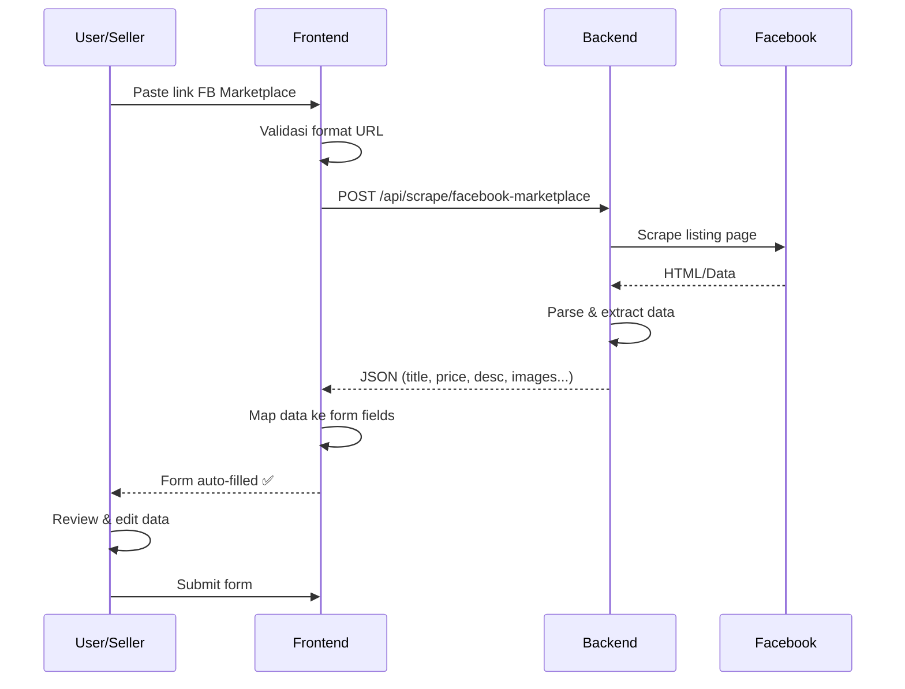

# 📋 Spesifikasi API: Facebook Marketplace Scraper

> [!IMPORTANT]
> Dokumen ini berisi spesifikasi endpoint backend yang **HARUS dibuat oleh tim backend** agar fitur "Quick Import dari Facebook Marketplace" di frontend bisa berfungsi.

---

## Endpoint

```
POST /api/scrape/facebook-marketplace
```

## Headers

| Header | Value |
|--------|-------|
| `Content-Type` | `application/json` |
| `Authorization` | `Bearer {token}` *(user harus login)* |

## Request Body

```json
{
  "url": "https://www.facebook.com/marketplace/item/1234567890"
}
```

| Field | Type | Required | Keterangan |
|-------|------|----------|------------|
| `url` | `string` | ✅ | URL lengkap listing Facebook Marketplace |

### URL Patterns yang Valid

Frontend akan melakukan validasi awal terhadap URL sebelum mengirim ke backend. Berikut pola URL yang diterima:

```
https://facebook.com/marketplace/item/{id}
https://www.facebook.com/marketplace/item/{id}
https://m.facebook.com/marketplace/item/{id}
https://fb.com/marketplace/item/{id}
```

---

## Response Success (200)

```json
{
  "success": true,
  "data": {
    "title": "iPhone 13 Pro Max 256GB",
    "description": "Kondisi mulus, baru pake 6 bulan. Fullset box, charger, case...",
    "price": "12500000",
    "condition": "Like New",
    "location": "Semarang",
    "category": "Electronics",
    "images": [
      "https://scontent.xxx/image1.jpg",
      "https://scontent.xxx/image2.jpg",
      "https://scontent.xxx/image3.jpg"
    ],
    "source_url": "https://www.facebook.com/marketplace/item/1234567890"
  }
}
```

### Detail Response Fields

| Field | Type | Required | Keterangan |
|-------|------|----------|------------|
| `title` | `string` | ✅ | Judul/nama produk dari listing |
| `description` | `string` | ✅ | Deskripsi produk |
| `price` | `string\|number` | ✅ | Harga dalam Rupiah (angka saja atau format "Rp 12.500.000") |
| `condition` | `string` | ⬜ | Kondisi barang (New, Like New, Good, Fair, Used) |
| `location` | `string` | ⬜ | Lokasi penjual |
| `category` | `string` | ⬜ | Kategori produk dari FB |
| `images` | `array[string]` | ⬜ | Array URL gambar produk (max 5) |
| `source_url` | `string` | ⬜ | URL asli listing |

> [!NOTE]
> Frontend akan otomatis melakukan mapping dari data mentah ke format form. Misal:
> - `condition: "Like New"` → mapped ke `kondisi: "like-new"`
> - `category: "Electronics"` → mapped ke `kategori: "elektronik-gadget"`
> - `location: "Semarang"` → mapped ke `lokasi: "semarang"`
> - `price: "Rp 12.500.000"` → parsed ke `harga: 12500000`

---

## Response Error

### 400 - Invalid URL

```json
{
  "success": false,
  "message": "URL yang diberikan bukan URL Facebook Marketplace yang valid"
}
```

### 422 - Scraping Failed

```json
{
  "success": false,
  "message": "Gagal mengambil data dari listing. Listing mungkin sudah dihapus atau bersifat privat."
}
```

### 429 - Rate Limited

```json
{
  "success": false,
  "message": "Terlalu banyak request. Coba lagi dalam beberapa menit."
}
```

### 500 - Server Error

```json
{
  "success": false,
  "message": "Terjadi kesalahan pada server saat proses scraping"
}
```

---

## 🔧 Rekomendasi Implementasi Backend

### Opsi 1: Server-Side Scraping (Rekomendasi)

Gunakan library scraping seperti:

| Stack | Library |
|-------|---------|
| **PHP/Laravel** | `Goutte`, `Symfony DomCrawler`, atau `facebook-scraper` via Python subprocess |
| **Node.js** | `Puppeteer`, `Playwright`, atau `Cheerio` |
| **Python** | `facebook-marketplace-scraper`, `BeautifulSoup`, `Selenium` |

### Opsi 2: Facebook Graph API (Jika Ada Akses)

Jika punya akses Facebook Business/Developer App:
- Gunakan **Facebook Graph API** untuk mendapatkan data listing secara resmi
- Endpoint: `GET /{listing-id}?fields=name,description,price,images,location`

> [!WARNING]
> Facebook Marketplace **tidak menyediakan public API resmi** untuk listing individual. Scraping harus dilakukan server-side karena:
> 1. **CORS**: Browser tidak bisa fetch langsung ke facebook.com
> 2. **Rate Limiting**: Facebook bisa block IP jika terlalu banyak request
> 3. **Dynamic Content**: Halaman FB sering di-render via JavaScript (butuh headless browser)

### Opsi 3: Headless Browser (Paling Reliable)

```php
// Contoh flow di Laravel dengan Browsershot (Puppeteer wrapper)
use Spatie\Browsershot\Browsershot;

$html = Browsershot::url($fbUrl)
    ->waitUntilNetworkIdle()
    ->bodyHtml();

// Parse $html dengan DomCrawler untuk extract data
```

---

## 🔒 Security Considerations

1. **Rate Limiting**: Batasi max 5-10 request per user per jam
2. **URL Validation**: Validasi URL di backend juga (jangan hanya frontend)
3. **Sanitize Output**: Sanitize semua data yang di-return ke frontend
4. **Timeout**: Set timeout 15-30 detik untuk proses scraping
5. **Caching**: Cache hasil scraping per URL selama 1 jam untuk mengurangi request ke FB

---

## 📁 Files yang Sudah Dibuat di Frontend

| File | Keterangan |
|------|------------|
| [scraperService.js](file:///c:/Antigravity/UI-v1/frontend/src/services/scraperService.js) | Service untuk mengirim URL ke backend dan mapping data hasil scrape |
| [AddProduct.jsx](file:///c:/Antigravity/UI-v1/frontend/src/pages/seller/AddProduct.jsx) | Modifikasi form dengan section "Quick Import dari Facebook Marketplace" |

## 🎯 User Flow


